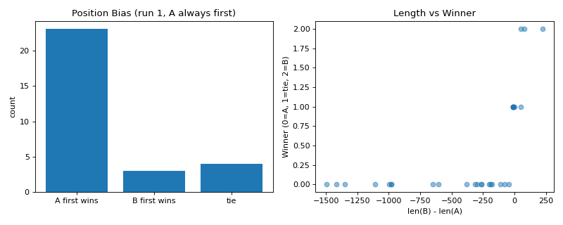

# Judge Bias Observations Report

## Bias 1: Position bias

A wins as first position: **23/30 = 76.7%**

Expected ~50% if no bias. >55% suggests position bias.

**Verdict:** WARNING: position bias detected

## Bias 2: Length bias

When B is longer (n=4), B wins: **75.0%**

Expected ~50% if no length preference. >60% suggests length bias.

**Verdict:** WARNING: length bias detected

## Chart

## Mitigation strategy

- **Position bias:** swap-and-average is already applied in B.1 — agreements kept, disagreements default to tie. This mitigates the raw position bias measured above.
- **Length bias:** if detected, add prompt instruction: "Length is NOT a factor; rate purely on accuracy + relevance." Re-run B.1 with updated prompt.
- **Long-term:** rotate judges (cross-judge protocol, bonus +3) to detect persistent biases.
