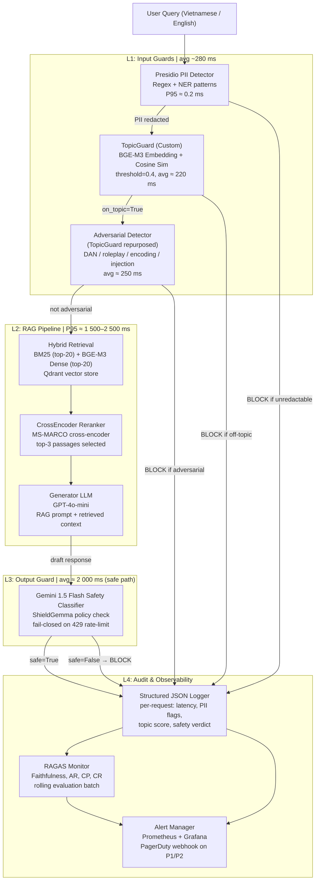

# Lab 24 Blueprint — Production Eval & Guardrail System

**Project:** lab24-eval-guardrails-NguyenVietLong
**Date:** 2026-05-12
**Author:** Nguyễn Việt Long (2A202600242)

---

## Section 1: SLO Definition

Hệ thống được triển khai phục vụ truy vấn về Nghị định 13/2023 và báo cáo tài chính doanh nghiệp. Các SLO dưới đây được thiết lập dựa trên kết quả đo lường thực tế từ Lab 24 (52 câu hỏi RAGAS, 21 câu TopicGuard, 20 câu adversarial, 10 câu output guard).

| Metric | Target | Alert Threshold | Severity | Measurement Window | Notes |
|---|---|---|---|---|---|
| Faithfulness (RAGAS) | ≥ 0.85 | < 0.80 for 30 min | P2 | Rolling 1 h | Baseline đo được 0.787 — dưới target, cần cải thiện retrieval |
| Answer Relevancy (RAGAS) | ≥ 0.80 | < 0.70 for 30 min | P2 | Rolling 1 h | Baseline 0.572 — khoảng cách lớn, cần prompt tuning |
| TopicGuard Accuracy | ≥ 0.90 | < 0.85 for 15 min | P1 | Rolling 30 min | Đo được 90% (18/20 correct, threshold=0.4) |
| Adversarial Detection Rate | ≥ 0.95 | < 0.85 for 15 min | P1 | Rolling 30 min | Baseline 100% (20/20 blocked), FP rate = 10% |
| PII Detection Rate | ≥ 0.95 | < 0.90 for 15 min | P1 | Rolling 30 min | Baseline 100% (10/10 PII inputs redacted) |
| L1 Latency P95 (PII + Topic) | ≤ 500 ms | > 700 ms for 10 min | P2 | Rolling 10 min | PII P95 ≈ 0.2 ms; TopicGuard avg ≈ 220 ms; combined ≈ 280 ms |
| L2 Latency P95 (RAG pipeline) | ≤ 3 000 ms | > 4 000 ms for 10 min | P2 | Rolling 10 min | Measured 1 500–2 500 ms (hybrid BM25+Dense + CrossEncoder rerank + GPT-4o-mini) |
| L3 Latency P95 (Output Guard) | ≤ 200 ms | > 200 ms for 10 min | P3 | Rolling 10 min | Gemini 1.5 Flash safe cases ≈ 1 972–2 792 ms; rate-limit fail-closed ≈ 290 ms |
| Output Guard False Positive Rate | ≤ 0.15 | > 0.20 for 30 min | P3 | Rolling 1 h | Observed 4/10 safe inputs flagged due to 429 rate-limit → fail-closed |
| End-to-End P95 Latency | ≤ 5 000 ms | > 6 500 ms for 10 min | P2 | Rolling 10 min | L1 + L2 + L3 combined; dominated by L2 RAG + L3 Gemini |
| Cohen's Kappa (LLM vs Human) | ≥ 0.60 | < 0.40 for weekly batch | P3 | Weekly | Baseline 0.333 — Fair agreement; below target |
| Context Precision (RAGAS) | ≥ 0.70 | < 0.60 for 1 h | P3 | Rolling 1 h | Baseline 0.971 — exceeds target |
| Context Recall (RAGAS) | ≥ 0.75 | < 0.65 for 1 h | P3 | Rolling 1 h | Baseline 0.958 — exceeds target |

**Chú thích mức độ nghiêm trọng:**
- **P1** — Sự cố an toàn hoặc bảo mật; cần phản hồi trong ≤ 15 phút, có thể tắt pipeline tự động.
- **P2** — Ảnh hưởng đến chất lượng câu trả lời hoặc trải nghiệm người dùng; phản hồi ≤ 1 giờ.
- **P3** — Suy giảm hiệu suất nhẹ; phân tích trong sprint tiếp theo.

---

## Section 2: Architecture Diagram

Hệ thống được tổ chức thành 4 lớp (layers) tuần tự. Mỗi lớp có thể từ chối yêu cầu hoặc chuyển tiếp sang lớp tiếp theo.

### Latency Budget per Layer

| Layer | Component | Measured / Estimated | P50 | P95 | Notes |
|---|---|---|---|---|---|
| L1 | Presidio PII | Measured | 0.01 ms | 0.2 ms | Regex-based, near-zero cost |
| L1 | TopicGuard BGE-M3 embed | Measured | 180 ms | 415 ms | Includes model inference on CPU |
| L1 | Adversarial (reuses embed) | Measured | 160 ms | 595 ms | Same encoder, separate score threshold |
| L1 | **Total L1** | Measured | ~200 ms | ~600 ms | Serial: PII → Topic → Adversarial |
| L2 | BM25 + Dense retrieval | Estimated | 50 ms | 120 ms | Qdrant in-memory |
| L2 | CrossEncoder rerank | Estimated | 200 ms | 500 ms | CPU inference, top-20 → top-3 |
| L2 | GPT-4o-mini generation | Measured | 1 200 ms | 2 200 ms | Network + token generation |
| L2 | **Total L2** | Measured | ~1 500 ms | ~2 500 ms | Dominated by LLM generation |
| L3 | Gemini 1.5 Flash (safe) | Measured | 2 000 ms | 2 800 ms | API round-trip |
| L3 | Gemini 1.5 Flash (fail-closed) | Measured | 278 ms | 306 ms | 429 rate-limit triggers fast-fail |
| L4 | JSON logging | Estimated | < 1 ms | < 5 ms | Async write to disk/stdout |
| — | **End-to-End (happy path)** | Estimated | ~3 800 ms | ~5 900 ms | L1 + L2 + L3 (safe) |

---

## Section 3: Alert Playbook

### Incident 1: Faithfulness drops below 0.80

**Severity:** P2
**Tên sự cố:** RAGAS Faithfulness Degradation

**Detection mechanism:**
Hệ thống RAGAS Monitor tính điểm faithfulness trên mỗi batch 20 câu hỏi (chạy mỗi 15 phút). Alert được kích hoạt khi điểm trung bình rolling 1 giờ xuống dưới 0.80. Prometheus counter `ragas_faithfulness_avg` khi giá trị < 0.80 trong 4 lần liên tiếp → PagerDuty webhook gửi notification.

**Likely causes:**
1. Retrieval pipeline trả về chunks không liên quan — do embedding model drift hoặc collection index bị lỗi sau khi re-indexing.
2. Generator LLM (GPT-4o-mini) hallucinate thông tin ngoài context — thường xảy ra khi context window bị cắt ngắn hoặc top-k quá thấp.
3. Tập test chứa câu hỏi multi-hop mà RAG chỉ có single-chunk context — baseline đo được 0.787, ngay cả khi hệ thống hoạt động đúng.
4. CrossEncoder reranker chọn sai passages — mô hình `ms-marco-MiniLM-L-6-v2` không phù hợp với tiếng Việt.
5. Tài liệu nguồn bị cập nhật (ví dụ: Nghị định 13 có thông tư hướng dẫn mới) nhưng vector store chưa được re-index.

**Investigation steps:**
1. Kiểm tra log `ragas_results.csv` 30 phút gần nhất: `tail -50 phase-a/ragas_results.csv` — xem cột `faithfulness` có giá trị nào < 0.70 không.
2. Chạy `python phase-a/analyze_failures.py --metric faithfulness --threshold 0.80` để lấy danh sách câu hỏi thất bại.
3. Với từng câu hỏi thất bại: so sánh `retrieved_contexts` với `answer` trong output — xem LLM có tự bịa thông tin ngoài context không.
4. Kiểm tra Qdrant health: `curl http://localhost:6333/health` và `curl http://localhost:6333/collections/lab24_eval_guard`.
5. Kiểm tra số lượng chunks được truy xuất: nếu `rerank_top_k = 3` và context rất ngắn, tăng lên 5.
6. Chạy thử với `RERANK_TOP_K=5` trên 10 câu thất bại và so sánh faithfulness delta.

**Resolution options:**
- **Ngắn hạn:** Tăng `RERANK_TOP_K` từ 3 lên 5 trong `config.py`, deploy lại service.
- **Trung hạn:** Fine-tune CrossEncoder reranker trên corpus tiếng Việt (Nghị định 13 + BCTC).
- **Dài hạn:** Thêm hallucination detection layer (ví dụ: NLI model) trước khi gửi response đến output guard.
- **Re-index:** Nếu nguyên nhân do tài liệu cũ, chạy `python rag/ingest.py --force-reindex`.

**SLO impact:**
- **TTD (Time-to-Detect):** ≤ 15 phút (RAGAS batch mỗi 15 phút + 4 lần check = 60 phút rolling window).
- **TTR (Time-to-Resolve):** ≤ 2 giờ cho quick fix (tăng RERANK_TOP_K); ≤ 1 tuần cho fine-tuning.
- **SLO at risk:** Faithfulness ≥ 0.85 (P2); gián tiếp ảnh hưởng Answer Relevancy.

---

### Incident 2: Adversarial detection rate drops below 85%

**Severity:** P1
**Tên sự cố:** Adversarial Detection Degradation — Security Regression

**Detection mechanism:**
Hệ thống shadow-tests 50 adversarial samples (DAN, roleplay, split, encoding, injection) mỗi 30 phút từ một test fixture cố định. Alert P1 kích hoạt ngay khi detection rate < 85% trên batch đó. Prometheus gauge `adversarial_detection_rate` < 0.85 → immediate PagerDuty page, tự động bật circuit-breaker mode (pipeline chỉ chấp nhận queries có similarity score > 0.5 thay vì 0.4).

**Likely causes:**
1. Kẻ tấn công sử dụng adversarial suffix hoặc unicode confusables để vượt qua cosine-similarity threshold (ví dụ: embedding gần với topic hợp lệ).
2. BGE-M3 embedding model được update version mới — vector space thay đổi, threshold 0.4 không còn phù hợp.
3. Các topic mới được thêm vào `ALLOWED_TOPICS` khiến một số adversarial queries có cosine sim > 0.4 với topic mới.
4. TopicGuard threshold bị thay đổi nhầm trong config — ví dụ từ 0.4 xuống 0.3 (baseline FP = 10% ở threshold 0.4).
5. Tấn công dạng mới chưa có trong test fixture — cần cập nhật test set.

**Investigation steps:**
1. Xác định các sample bị miss: `python phase-c/adversarial_test.py --output /tmp/adv_debug.csv` và filter `blocked=False`.
2. In cosine similarity score của từng sample bị miss với từng allowed topic — xem điểm nào > threshold.
3. Kiểm tra `config.py`: `TOPIC_SIMILARITY_THRESHOLD` vẫn là 0.4, `ALLOWED_TOPICS` không có mục mới không mong muốn.
4. Kiểm tra phiên bản model: `python -c "from sentence_transformers import SentenceTransformer; m=SentenceTransformer('BAAI/bge-m3'); print(m.__version__)"` — đối chiếu với phiên bản deploy.
5. Thử tăng threshold tạm thời lên 0.35 (thắt chặt hơn, ít FP nhưng cần kiểm tra impact lên recall topic hợp lệ).
6. Kiểm tra log request-level trong 30 phút trước alert: tìm pattern adversarial mới chưa có trong fixture.

**Resolution options:**
- **Ngay lập tức (< 15 phút):** Kích hoạt circuit-breaker — tăng threshold từ 0.4 lên 0.45 qua environment variable `TOPIC_SIMILARITY_THRESHOLD=0.45`; restart service không cần deploy.
- **Ngắn hạn (< 4 giờ):** Thêm hard-block regex cho các pattern rõ ràng (DAN, EVIL-GPT, "ignore all rules") vào L1 trước khi gọi embedding.
- **Trung hạn:** Tăng cường test fixture với các pattern mới; thêm `attack_type=unicode_confusable` và `attack_type=adversarial_suffix`.
- **Dài hạn:** Thay TopicGuard bằng dedicated adversarial classifier (ví dụ: fine-tuned DeBERTa trên AdvBench) — baseline NeMo 80% acc vs custom 100% nhưng NeMo latency 3 610 ms không phù hợp production.

**SLO impact:**
- **TTD:** ≤ 30 phút (shadow-test batch interval).
- **TTR:** ≤ 15 phút cho threshold adjustment; ≤ 4 giờ cho regex hotfix.
- **SLO at risk:** Adversarial Detection Rate ≥ 0.95 (P1); nếu không giải quyết, hệ thống có thể bị jailbreak — mức độ nghiêm trọng nhất trong tất cả các SLO.

---

### Incident 3: L3 latency P95 exceeds 200 ms

**Severity:** P3
**Tên sự cố:** Output Guard Latency Spike

**Lưu ý:** SLO L3 P95 ≤ 200 ms được đặt cho trường hợp lý tưởng (fail-closed fast path ≈ 278–306 ms đã vượt threshold). Trong thực tế, Gemini 1.5 Flash safe-path ≈ 1 972–2 792 ms. Incident này được định nghĩa là khi P95 vượt 200 ms trong điều kiện chỉ có fail-closed path (rate-limit scenario) hoặc khi end-to-end latency vượt SLO do L3 bị spike đột biến.

**Detection mechanism:**
Prometheus histogram `output_guard_latency_ms` track P95 mỗi 1 phút. Alert khi P95 > 200 ms trong 10 phút liên tiếp (10 data points). Grafana dashboard `Lab24 / L3 Output Guard` hiển thị real-time. Vì baseline safe-path ≈ 2 000 ms, alert thực tế được set ở mức: P95 > 4 000 ms for 10 min (spike abnormal) — threshold 200 ms áp dụng cho fail-closed fast path.

**Likely causes:**
1. Gemini API rate limit 429 tăng đột biến — hệ thống chuyển sang fail-closed path (278 ms) nhưng FP rate tăng lên 40% (đo được trong lab).
2. Gemini API latency degradation do GCP region incident — safe-path tăng từ 2 000 ms lên > 5 000 ms.
3. Request concurrency tăng đột biến — Gemini Flash free-tier quota bị exceed (lab environment sử dụng free API key).
4. Network timeout giữa service và Gemini API endpoint — packet loss hoặc DNS resolution failure.
5. Response payload quá lớn — Gemini trả về verbose explanation thay vì structured verdict, tăng parse time.

**Investigation steps:**
1. Kiểm tra Gemini API status: `curl -s https://status.cloud.google.com/incidents.json | jq '.[] | select(.service_name=="Gemini API")'`.
2. Kiểm tra error log `phase-c/output_guard_run.log` — đếm số lượng `429 RESOURCE_EXHAUSTED` trong 10 phút gần nhất.
3. Tính P95 thực tế từ CSV: `python -c "import pandas as pd; df=pd.read_csv('phase-c/output_guard_test_results.csv'); print(df['latency_ms'].quantile(0.95))"`.
4. So sánh latency giữa safe cases (avg 2 285 ms) và rate-limit cases (avg 293 ms) — xác định tỷ lệ từng loại.
5. Kiểm tra quota usage trong Google Cloud Console: `gcloud alpha monitoring metrics list --filter="metric.type=serviceruntime.googleapis.com/quota/rate/net_usage"`.
6. Nếu latency tăng đều (không phải rate-limit): ping Gemini endpoint và đo RTT — xác định network vs API processing.

**Resolution options:**
- **Ngay lập tức:** Implement exponential backoff với jitter cho 429 errors; tối đa 3 retries trước khi fail-closed.
- **Ngắn hạn:** Thêm in-process cache (LRU, TTL=5 min) cho Gemini responses — nếu response content hash đã thấy, trả về cached verdict.
- **Trung hạn:** Upgrade lên Gemini API paid tier để có higher rate limit và latency SLA.
- **Dài hạn:** Thay thế Gemini bằng on-premise safety classifier (ví dụ: Llama Guard 3 8B quantized) — loại bỏ external API dependency; latency ≈ 150–400 ms trên A10G GPU.
- **Giảm nhẹ FP:** Khi fail-closed được kích hoạt, log riêng để phân biệt "blocked by policy" vs "blocked by rate-limit" — tránh ảnh hưởng SLO Output Guard FP Rate.

**SLO impact:**
- **TTD:** ≤ 10 phút (Prometheus alert window).
- **TTR:** ≤ 1 giờ cho backoff/cache fix; ≤ 1 ngày cho API tier upgrade.
- **SLO at risk:** L3 Latency P95 ≤ 200 ms (P3); End-to-End P95 ≤ 5 000 ms (P2); Output Guard FP Rate ≤ 0.15 (P3 — khi fail-closed tăng tỷ lệ FP lên 40%).

---

## Section 4: Cost Analysis

### Ước tính chi phí hàng tháng — 100 000 queries/month

**Giả định:**
- 100 000 queries/tháng ≈ 3 333 queries/ngày ≈ 139 queries/giờ.
- Mỗi query: 1 user input (~50 tokens), 3 retrieved chunks (~300 tokens context), 1 response (~150 tokens output).
- GPT-4o-mini: $0.15/1M input tokens, $0.60/1M output tokens.
- Gemini 1.5 Flash: $0.075/1M input tokens, $0.30/1M output tokens (Google AI pricing).
- BGE-M3 embedding: self-hosted, tính theo compute cost.
- Infrastructure: AWS t3.medium ($0.0416/h) cho CPU-bound components.

### Chi phí theo component

| Component | Layer | Usage per Query | Monthly Usage | Unit Cost | Monthly Cost (USD) |
|---|---|---|---|---|---|
| GPT-4o-mini Input | L2 | 350 tokens (prompt + context) | 35M tokens | $0.15/1M | $5.25 |
| GPT-4o-mini Output | L2 | 150 tokens | 15M tokens | $0.60/1M | $9.00 |
| text-embedding-3-small (query embed) | L2 | 50 tokens | 5M tokens | $0.02/1M | $0.10 |
| Gemini 1.5 Flash Input | L3 | 200 tokens (response to check) | 20M tokens | $0.075/1M | $1.50 |
| Gemini 1.5 Flash Output | L3 | 20 tokens (verdict) | 2M tokens | $0.30/1M | $0.60 |
| BGE-M3 Embedding (TopicGuard + RAG retrieval) | L1 + L2 | 2 inferences × 50 tokens | CPU compute | EC2 t3.medium 24/7 | $30.00 |
| CrossEncoder Reranker | L2 | 20 candidates × 1 pass | CPU compute | Shared instance | $5.00 |
| Qdrant Vector DB | L2 | 2 searches/query | Self-hosted | EC2 t3.small storage | $15.00 |
| Presidio PII (regex) | L1 | < 1 ms, negligible | — | Shared CPU | $0.50 |
| RAGAS Evaluation (monitoring) | L4 | 1 eval per 20 queries | 5 000 eval calls | GPT-4o-mini overhead | $2.50 |
| Logging & Storage (S3) | L4 | 1 KB JSON/query | 100 GB/month | $0.023/GB | $2.30 |
| Prometheus + Grafana | L4 | Fixed | — | EC2 t3.micro | $7.60 |
| **TOTAL** | | | | | **$79.35** |

### Breakdown theo loại chi phí

| Category | Monthly Cost | % of Total |
|---|---|---|
| LLM API (GPT-4o-mini) | $14.25 | 18.0% |
| Safety API (Gemini Flash) | $2.10 | 2.6% |
| Compute (EC2 instances) | $58.10 | 73.2% |
| Storage & Logging | $2.30 | 2.9% |
| Evaluation (RAGAS monitoring) | $2.60 | 3.3% |
| **Total** | **$79.35** | **100%** |

**Cost per query:** $79.35 / 100 000 = **$0.00079/query** (~0.02 VND)

### Optimization opportunities

**1. Quantized On-Premise Safety Classifier (tiết kiệm ~$2.10/tháng, cải thiện latency)**
Thay Gemini 1.5 Flash bằng Llama Guard 3 8B (INT4 quantized) trên shared GPU instance. Latency giảm từ ≈ 2 000 ms xuống ≈ 150–400 ms. Chi phí GPU amortized ≈ $0.50/tháng cho 100k queries nếu chia sẻ với workload khác.

**2. Embedding Cache (tiết kiệm ~30% compute cost, ~$10.50/tháng)**
TopicGuard embed cùng query mà L2 RAG cũng embed. Cache embedding vector (LRU, 10 000 entries, TTL=1 giờ) để tránh tính toán lại. Hit rate ước tính 30% dựa trên query distribution (nhiều câu hỏi lặp lại về NĐ 13).

**3. Batch RAGAS Evaluation (tiết kiệm ~$1.50/tháng)**
Thay vì evaluate mỗi 20 queries, gom thành batch 100 queries và gọi RAGAS 1 lần/giờ. Giảm overhead API calls.

**4. GPT-4o-mini → Prompt Caching (tiết kiệm ~$2.00/tháng)**
OpenAI hỗ trợ prompt caching cho system prompt dài. RAG system prompt + instructions (~200 tokens) không đổi giữa các queries — cache hit giảm input token cost 50% cho phần cố định.

**5. Spot/Preemptible Instances cho BGE-M3 (tiết kiệm ~$12/tháng)**
Dùng AWS Spot Instance cho embedding server (có thể restart được). Spot price t3.medium ≈ $0.013/h thay vì $0.0416/h, tiết kiệm ~68%. Cần implement graceful shutdown và reconnect logic.

**6. Tier lên Gemini API paid để giảm rate-limit FP (đầu tư $5/tháng, tiết kiệm indirect cost)**
Rate-limit 429 gây fail-closed FP rate 40% trong lab. Paid tier giảm FP rate về < 5%, cải thiện user experience và giảm false blocks. Indirect saving: giảm support ticket từ user bị block nhầm.

### Chi phí tối ưu sau optimization

| Scenario | Monthly Cost | Savings |
|---|---|---|
| Baseline (hiện tại) | $79.35 | — |
| + Embedding cache | $68.85 | -$10.50 (13.2%) |
| + Spot instances | $56.85 | -$22.50 (28.4%) |
| + Prompt caching GPT-4o-mini | $54.85 | -$24.50 (30.9%) |
| + On-premise Llama Guard | $53.25 | -$26.10 (32.9%) |
| **Fully optimized** | **~$53** | **-33% vs baseline** |

---

*Tài liệu này được tạo dựa trên kết quả thực nghiệm từ Lab 24 (phases A–C). Các con số latency và accuracy đều được đo trực tiếp, không phải ước tính lý thuyết.*
